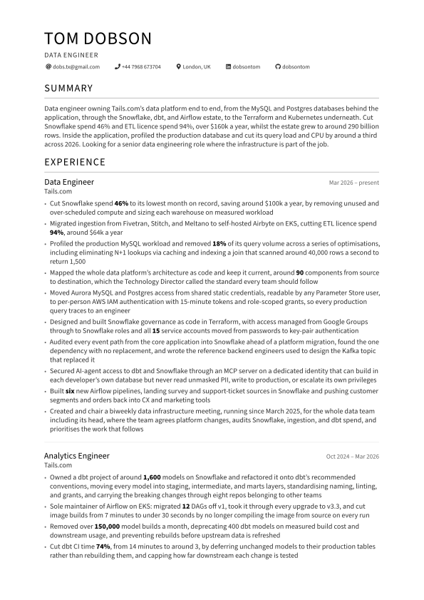
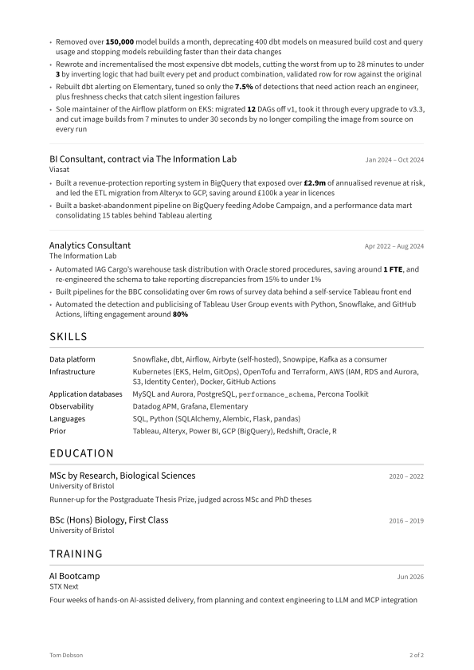

<div align="center">

# `cv`

Tom Dobson's CV, written in LaTeX and built by GitHub Actions

[dobs.tx@gmail.com](mailto:dobs.tx@gmail.com) ·
[linkedin.com/in/dobsontom](https://linkedin.com/in/dobsontom)


**[Download the PDF](https://github.com/dobsontom/cv/releases/latest/download/Tom-Dobson-CV.pdf)**




</div>

## Building

Needs TeX Live 2023, `latexmk`, and `poppler-utils`. On Ubuntu 24.04:

```sh
sudo apt install texlive-latex-base texlive-latex-extra texlive-fonts-extra latexmk poppler-utils
```

```sh
make          # compile to build/Tom-Dobson-CV.pdf
make check    # compile, then check page count, metadata, text extraction, and overfull lines
make lint     # Prettier and ShellCheck
make format   # fix what lint reports
```

The [AltaCV](https://github.com/liantze/AltaCV) class under `vendor/altacv/` is used as published.
Every change to the look lives in `cvstyle.sty`, and the words in `Tom-Dobson-CV.tex`.

## Releasing

```sh
make preview               # refresh both .github/preview-*.svg, then commit them
make release               # tag today's date and push
```

`make release` checks the PDF, refreshes the previews, and refuses to tag whilst anything is
uncommitted. It tags `vYYYY.MM.DD` from today's date, so pass `TAG=` to override that or to cut a
second release on a day that already has one.

The [workflow](.github/workflows/build.yml) builds and checks the PDF, then creates the release with
it attached. The download link above always resolves to the newest one.

## Licence

The tooling is MIT. The class in `vendor/altacv/` is LPPL and unmodified. The CV itself is mine, all
rights reserved.
